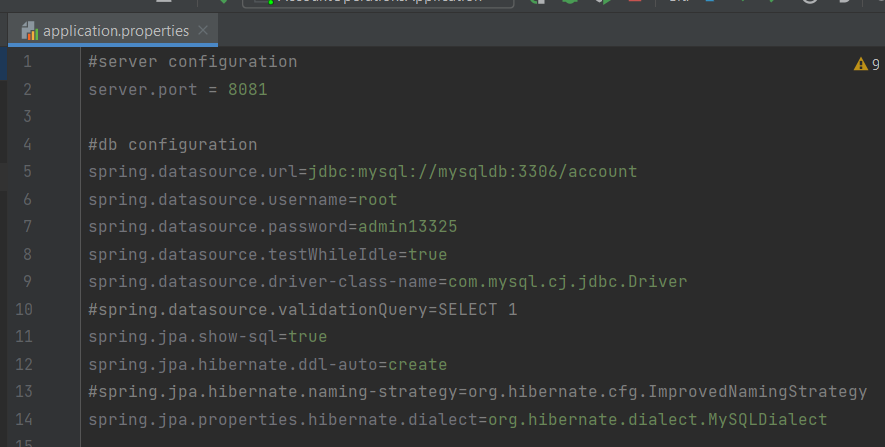
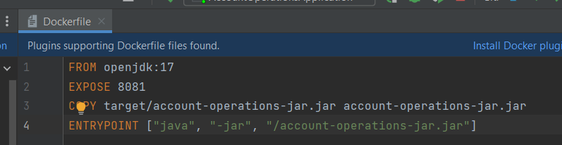
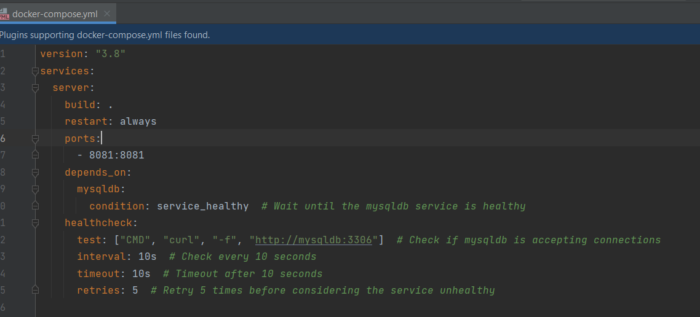
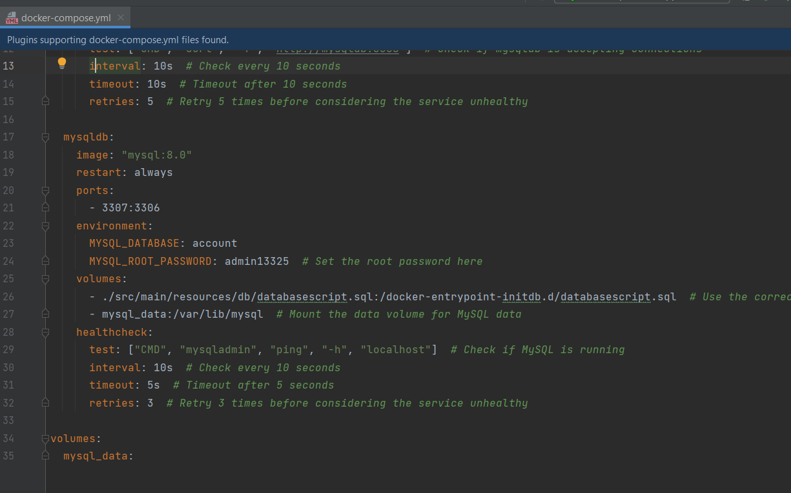

<h1 align="center">Welcome to Account Operations 👋</h1>
<p>
  <a href="ad" target="_blank">
    
  </a>
</p>

> It is like a Bank Interface. A user can add account, withdraw and deposit money, and check their last 30 days transaction history. There will be some rules for withdraw and deposit for different type of bank accounts.

### ✨ [Demo](asd)

# Project Setup

Documentation Link -> https://docs.google.com/document/d/1EeO0RLbPuL4LGwjOOENKgPzMYOgfS2yrP0DbOzicXww/edit?usp=sharing

API Collection Link -> https://api.postman.com/collections/28775522-f100d783-d011-4b4f-bcfb-1bcdf5818a91?access_key=PMAT-01H6C8KVZ2CH8F8QX13CNX81E3

## TechStack
```text
1. Java 17
2. SpringBoot 3.1.2
3. MySQL 8
4. Maven
5. Docker 24.0.2
```


## Deployment Steps

### Setup Files

Application Properties File




Docker File




Docker Compose File -> server setup configurations




Docker Compose File -> mysql setup configurations




### Running locally
1. Install Java 17 and Mysql 8 and clone the repo. Create the database ***account*** manually
2. Set these mysql properties in the application properties file ->
```text
server.port=8081
-------------------------------------------------------------------------
spring.datasource.url=jdbc:mysql://localhost:3306/account
spring.datasource.username=<username>
spring.datasource.password=<password>
```
3. Now go to ***AccountOperationsApplication*** Class and run it to start the application.

### Deploying on docker
1. Install maven and docker and docker-compose. Build the project by running this command
```text
mvn clean install -DskipTests
```
2. The jar file will be created at **./target/account-operations-jar.jar** .
3. Change the password in Docker Compose File for mysql setup. It will run as root.
4. Go to the root of this project and open terminal and type this command to run the application.
```text
docker-compose up
```

You can access the apis via postman on 8081 port.


## Author

👤 **Saumitra Chauhan**

* Website: https://read.cv/saumitra
* Github: [@SHADOW13325](https://github.com/SHADOW13325)
* LinkedIn: [@saumitrachauhan](https://linkedin.com/in/saumitrachauhan)
