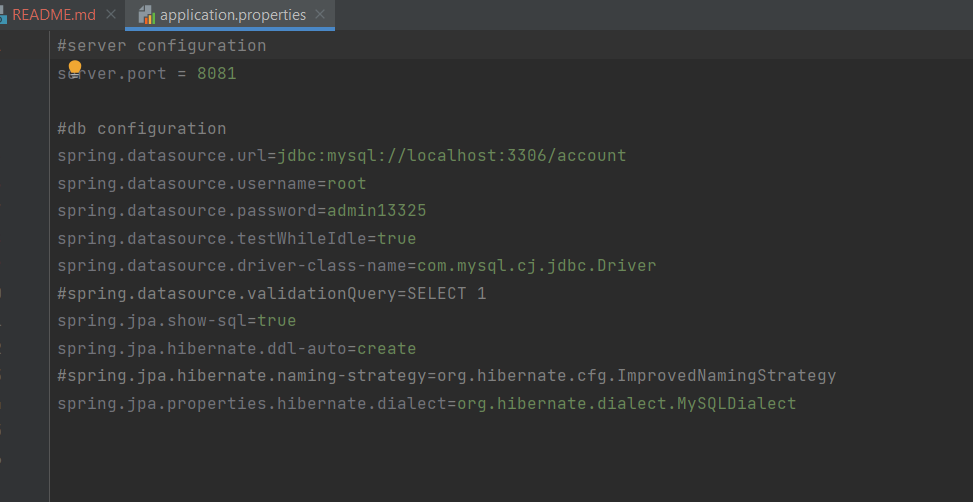

<h1 align="center">Welcome to Account Operations 👋</h1>
<p>
  <a href="ad" target="_blank">
    
  </a>
</p>

> It is like a Bank Interface. A user can add account, withdraw and deposit money, and check their last 30 days transaction history. There will be some rules for withdraw and deposit for different type of bank accounts.

### ✨ [Demo](asd)

## Project Setup

Documentation Link -> https://docs.google.com/document/d/1EeO0RLbPuL4LGwjOOENKgPzMYOgfS2yrP0DbOzicXww/edit?usp=sharing

API Collection Link -> https://api.postman.com/collections/28775522-f100d783-d011-4b4f-bcfb-1bcdf5818a91?access_key=PMAT-01H6C8KVZ2CH8F8QX13CNX81E3

### TechStack
```text
1. Java 17
2. SpringBoot 3.1.2
3. MySQL 8
4. Maven
```



### DB Configuration

1. Install MySQL8 and create a database ***account*** or you can reconfigure by changing the property value.
        ***spring.datasource.url=jdbc:mysql://localhost:3306/account***
2. Reconfigure your username and password in the above file.
3. Once you run the project the tables get automatically created. You can change the property ***spring.jpa.hibernate.ddl-auto*** from ***create*** to ***update*** if you don't want to drop your tables every time you restart the project.


### Deployment Steps
Run locally 
1. After cloning the repo and installing the techstack you can directly go to ***AccountOperationsApplication*** Class and run it to start the application. The default server port is configured 8081 in ***application.properties*** file.


## Author

👤 **Saumitra Chauhan**

* Website: https://read.cv/saumitra
* Github: [@SHADOW13325](https://github.com/SHADOW13325)
* LinkedIn: [@saumitrachauhan](https://linkedin.com/in/saumitrachauhan)
